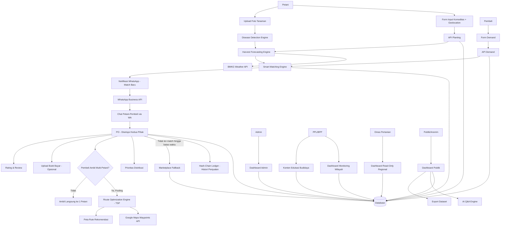
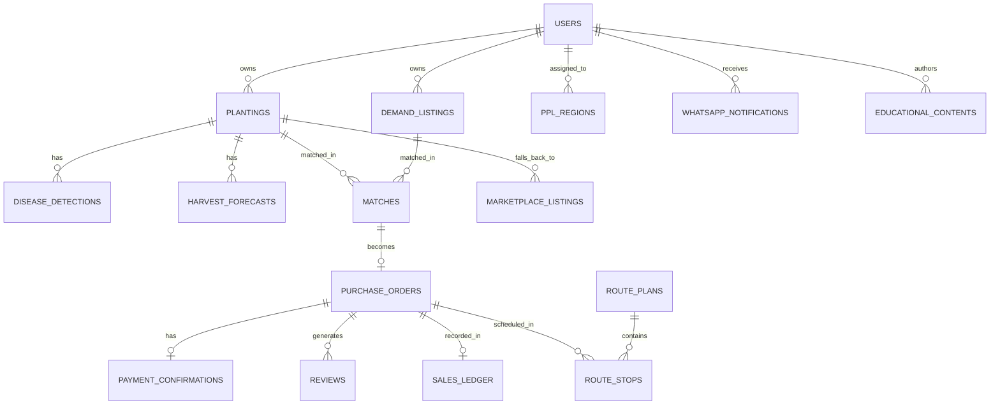

# PRD — Project Requirements Document: TaniLink

## 1. Overview

TaniLink adalah platform web yang menghubungkan petani mikro berlahan kecil — yang umumnya tidak punya akses pasar atau kalah bersaing dengan petani besar — langsung dengan pembeli (institusi, pengumpul, maupun end buyer), sejak tahap rencana tanam, bukan setelah panen selesai.

Sistem membangun data suplai masa depan: begitu petani menginput apa yang ditanam dan kapan, sistem menarik data BMKG untuk mengestimasi jadwal dan kondisi panen, sehingga pembeli bisa melihat dan mengunci stok jauh sebelum panen tiba lewat Purchase Order (PO).

Di sisi lain, pembeli mempublikasikan kebutuhan (komoditas, volume, tenggat waktu), dan Smart Matching Engine mencocokkan kedua sisi berdasarkan bobot jarak, waktu panen, harga, dan rekam jejak transaksi.

Setelah PO disepakati, petani mendapat kepastian pasar dari awal musim tanam — bukan menunggu panen dulu baru mencari pembeli. Panen yang gagal ter-match dengan pembeli institusional tetap punya jalur kedua lewat marketplace terbuka, supaya tidak ada hasil panen yang "nyangkut" tanpa pembeli.

### Masalah Utama yang Diselesaikan

- Petani mikro menanam tanpa kepastian pembeli, sehingga rentan dipermainkan harga oleh tengkulak.
- Volume panen kecil dan tersebar dari banyak petani sulit memenuhi kebutuhan volume pembeli institusional bila dikirim satu-satu.
- Petani tidak punya alat bantu prediksi (cuaca, harga, potensi penyakit tanaman) yang biasanya hanya dimiliki petani besar/korporasi.
- Tidak ada lapisan data publik yang bisa dipakai pemerintah/peneliti untuk memantau ketahanan pangan wilayah secara real-time.
- Pembeli yang mengambil dari banyak titik panen kecil sekaligus dalam satu hari tidak punya alat bantu perencanaan rute yang efisien.

### Tujuan Utama Aplikasi

- Memberi petani mikro kepastian pasar sejak awal musim tanam lewat PO pre-harvest.
- Menyediakan alat bantu keputusan berbasis data (prediksi panen berbasis BMKG, prediksi harga, deteksi dini penyakit tanaman dari foto) yang selama ini eksklusif dimiliki pemain besar.
- Mempertemukan suplai dan permintaan lewat rekomendasi matching berbobot, dengan jalur cadangan (marketplace terbuka) bila tidak ada match institusional.
- Memberi pembeli alat bantu operasional: rekomendasi rute pengambilan multi-titik, chat langsung, dan sistem rating/review.
- Membangun rekam jejak transaksi yang tidak bisa dimanipulasi (histori penjualan berbasis hash-chain) sebagai fondasi kepercayaan.
- Menyediakan dashboard publik yang transparan bagi pemerintah, peneliti, dan masyarakat umum, lengkap dengan tanya-jawab berbasis AI dan ekspor dataset.

---

## 2. Requirements

- Sistem harus mendukung peran: **Petani**, **Pembeli** (institusi/pengumpul/end buyer), **PPL/BPP** (monitoring wilayah + kontributor konten edukasi), **Admin**, dan **Dinas Pertanian** (read-only regional). Dashboard publik dapat diakses tanpa login.
- Petani menginput data komoditasnya sendiri: jenis komoditas, tanggal tanam, luas lahan, dan titik lokasi (otomatis dari geolocation perangkat, dapat disesuaikan dengan menggeser pin di peta).
- Sistem harus menarik data cuaca/musim dari API BMKG untuk mengestimasi tanggal panen dan tingkat risiko cuaca terhadap komoditas yang ditanam.
- Petani dapat mengunggah foto tanaman untuk deteksi dini penyakit tanaman berbasis image classification; hasil diagnosis dipakai untuk mengoreksi estimasi volume panen (tanaman terindikasi sakit → estimasi volume diturunkan secara proporsional).
- Sistem harus menghasilkan prediksi harga per komoditas untuk 1–4 minggu ke depan berdasarkan data harga historis, cuaca, dan tren permintaan.
- Pembeli dapat mempublikasikan kebutuhan (demand): komoditas, volume, lokasi, dan tenggat waktu dibutuhkan — tanpa perlu menunggu hasil panen tersedia.
- Sistem harus menghasilkan skor kecocokan (Smart Matching) antara demand pembeli dan planting petani berdasarkan bobot: jarak, kesesuaian waktu panen, kesesuaian harga, dan rating/histori transaksi petani. Bobot berbeda per kategori komoditas.
- Rekomendasi matching bersifat saran; PO hanya terbentuk bila kedua pihak menyetujui secara eksplisit di dalam sistem.
- Panen yang telah masuk masa siap-jual namun tidak memperoleh match dari demand institusional dalam jangka waktu tertentu harus otomatis dapat dipindahkan (atau secara manual oleh petani) ke marketplace terbuka sebagai jalur kedua, agar tetap terlihat oleh pembeli lain di luar hasil matching.
- Petani dan pembeli yang terhubung lewat matching harus bisa chat langsung via WhatsApp (WhatsApp Business API), bukan chat in-app terpisah, supaya petani tidak perlu belajar kanal baru.
- Sistem harus mengirim push notifikasi WhatsApp ke petani untuk: rekomendasi match baru, PO masuk, perubahan status PO, dan peringatan cuaca yang berpotensi mengganggu panen.
- Bila pembeli mengambil dari beberapa petani sekaligus dalam satu hari (pooling), sistem harus menyarankan rute pengambilan terpendek menggunakan Google Maps Waypoints API (pendekatan Traveling Salesman Problem/TSP), dengan opsi bagi pembeli untuk menyimpang dari urutan yang disarankan.
- Sistem harus menyimpan setiap transaksi (PO selesai) sebagai catatan histori penjualan yang tidak bisa diubah diam-diam, menggunakan skema hash-chain (setiap catatan menyimpan hash dari catatan sebelumnya) sebagai dasar kepercayaan dan anti-manipulasi data.
- Petani memiliki prioritas distribusi: bila lebih dari satu pembeli tertarik pada satu batch panen yang sama, sistem menentukan urutan layanan berdasarkan urutan PO masuk, kesesuaian volume, dan riwayat transaksi pembeli (bukan siapa yang menawar tertinggi).
- Setelah PO selesai, petani dan pembeli dapat saling memberi rating dan ulasan.
- PPL/BPP memiliki akses monitoring wilayah binaan (read-only atas data planting/matching/PO), ditambah kemampuan mempublikasikan konten edukasi budidaya per wilayah (bukan sekadar pemantau pasif).
- Dinas Pertanian memiliki akses read-only atas data agregat regional untuk kebutuhan kebijakan ketahanan pangan.
- Dashboard publik menampilkan: peta persebaran komoditas, harga pasar per komoditas/wilayah, fitur tanya-jawab berbasis AI atas data yang tersedia, dan opsi ekspor dataset (CSV/JSON) untuk peneliti/pihak ketiga.
- Sistem harus mobile-friendly karena mayoritas petani mengakses lewat HP di lapangan.
- MVP tidak membutuhkan payment gateway; pembayaran hasil PO disepakati di luar sistem, dengan kolom bukti pembayaran yang sifatnya opsional.

---

## 3. Core Features & Progress (Frontend MVP)

### A. Fitur Inti

**Database & Backend Base (Drizzle + PostgreSQL)**
- [x] *(Backend)* Migrasi database dari `localStorage` ke PostgreSQL menggunakan Drizzle ORM.
- [x] *(Backend)* Implementasi REST API endpoint (`/api/...`) untuk entitas utama (Harvests, Demands, Matches, PreOrders, Users).
- [x] *(Frontend)* Refactor frontend service untuk menggunakan endpoints API (Next.js App Router).

**Input Komoditas & Harvest Forecasting (BMKG-Integrated)**
- [x] *(UI)* Petani input jenis komoditas, tanggal tanam, luas lahan, titik lokasi (geolocation otomatis + penyesuaian pin via click — belum drag gesture).
- [ ] *(Backend)* Sistem menarik data cuaca/musim real-time dari API BMKG (saat ini memakai pola musim statis + `bmkg.ts` mock risk engine).

**Deteksi Penyakit Tanaman dari Foto**
- [ ] *(Backend)* Petani foto tanaman lewat HP, sistem mendiagnosis kemungkinan penyakit/hama secara cepat.
- [ ] *(Backend)* Hasil diagnosis memengaruhi estimasi volume panen di modul Harvest Forecasting.
- [ ] *(Backend)* Riwayat diagnosis tersimpan di dashboard petani.
- **Catatan:** `@tensorflow/tfjs` ter-install tapi belum dipakai. **Roadmap item.**

**Dashboard Petani**
- [x] *(UI)* Prediksi harga per komoditas, prediksi waktu panen, harga pasar terkini.
- [ ] *(UI)* Histori penjualan sebagai rekam jejak transaksi yang dapat diverifikasi (hash-chain). — **belum: hanya histori PO biasa**
- [x] *(UI)* Status prioritas distribusi saat batch panennya diminati lebih dari satu pembeli.

**Manajemen Demand (Pembeli)**
- [x] *(UI)* Pembeli membuat listing kebutuhan: komoditas, volume, lokasi, tenggat waktu.
- [x] *(UI)* Melihat peta sebaran prediksi panen petani di sekitar lokasinya.

**Smart Matching Engine**
- [x] *(Logic)* Skor gabungan dari jarak, kesesuaian waktu panen, kesesuaian harga.
- [ ] *(Logic)* Rating/histori transaksi petani sebagai faktor skor. — **belum masuk scoring**
- [x] *(Logic)* Bobot default berbeda per kategori komoditas.
- [x] *(Logic)* Bersifat rekomendasi — PO baru terbentuk setelah kedua pihak menyetujui.

**Purchase Order (PO)**
- [x] *(UI/Logic)* Pembeli mengunci stok petani sebelum panen selesai berdasarkan rekomendasi match.
- [x] *(UI/Logic)* Status PO: `confirmed` → `completed`, dengan kolom bukti pembayaran opsional (atomic transaction di `/api/pre-orders/confirm`).

**Marketplace Fallback**
- [ ] *(Backend)* Batch panen yang tidak ter-match dengan demand institusional dalam jangka waktu tertentu otomatis tampil di listing terbuka sederhana. — **roadmap item**

**Chat via WhatsApp**
- [x] *(UI)* Chat in-app (ChatModal) persisted ke DB via `/api/conversations` & `/api/messages`.
- [x] *(UI)* Link `wa.me` langsung ke WhatsApp di kartu match.
- [ ] *(Backend)* Terhubung lewat WhatsApp Business API langsung dari platform. — **roadmap item**

**Push Notifikasi WhatsApp**
- [ ] *(Backend)* Notifikasi otomatis: match baru, PO masuk/berubah status, peringatan cuaca. — **roadmap item (saat ini in-app toast)**

**Rekomendasi Rute Pengambilan (Route Optimization)**
- [x] *(UI/Backend)* Untuk pembeli/kolektor yang mengambil dari banyak titik sekaligus (pooling).
- [x] *(Logic)* **Clarke-Wright Savings + 2-opt Local Search** (`routeOptimizer.ts`) — bukan Google Maps Waypoints API.
- [x] *(UI)* Bersifat rekomendasi — kolektor bisa deviasi via status `PICKED_UP_DIRECTLY`.

**Histori Penjualan Berbasis Hash-Chain**
- [ ] *(Backend)* Setiap transaksi PO yang selesai dicatat sebagai entri yang menyimpan hash dari entri sebelumnya. — **belum diimplementasi (roadmap item)**
- **Catatan:** label "Hash-Chain" di PublicDashboard hanyalah teks dekoratif.

**Prioritas Distribusi**
- [x] *(UI/Logic)* Menentukan urutan layanan bila satu batch panen diminati lebih dari satu pembeli.

**Rating & Review**
- [x] *(UI/Logic)* Petani dan pembeli saling menilai setelah PO selesai.

**Konten Edukasi Budidaya (Kontribusi PPL/BPP)**
- [ ] *(Backend)* PPL/BPP dapat mempublikasikan konten edukasi budidaya per wilayah binaan. — **roadmap item**
- [x] *(UI)* Tampil di landing page/dashboard petani sesuai wilayahnya.

### B. Dashboard Publik
- [x] *(UI)* Peta persebaran komoditas (berdasarkan data planting yang dipublikasikan petani).
- [x] *(UI)* Harga komoditas per wilayah.
- [ ] *(Backend)* AI Q&A: publik dapat bertanya dalam bahasa natural terkait data yang tersedia. — **roadmap item**
- [ ] *(Backend)* Ekspor dataset (CSV/JSON) untuk peneliti. — **roadmap item**

### C. Dashboard Admin
- [x] *(UI)* Ringkasan planting, demand, match, dan PO aktif.
- [x] *(UI)* Panel pemantauan performa bobot Smart Matching per kategori komoditas (read-only).
- [ ] *(Backend)* Moderasi konten edukasi PPL, resolusi dispute data, dan moderasi rating/review.

### D. Dashboard Dinas Pertanian (Read-Only)
- [x] *(UI)* Data agregat regional: tren harga, sebaran planting, potensi surplus/defisit wilayah.

---

## 4. User Flow

### Flow Petani
1. Petani mendaftar/login, melengkapi nomor WhatsApp untuk notifikasi.
2. Petani input data komoditas: jenis, tanggal tanam, luas lahan, titik lokasi (geolocation otomatis, bisa disesuaikan manual).
3. Sistem menarik data BMKG dan menampilkan estimasi tanggal panen serta indikator risiko cuaca.
4. Petani dapat mengunggah foto tanaman kapan saja untuk deteksi dini penyakit; hasil diagnosis otomatis menyesuaikan estimasi volume panen.
5. Petani menerima notifikasi WhatsApp saat ada rekomendasi match dari demand pembeli yang cocok.
6. Petani chat dengan pembeli via WhatsApp untuk negosiasi, lalu menyetujui atau menolak PO.
7. Bila batch panennya diminati lebih dari satu pembeli, sistem menampilkan urutan prioritas distribusi ke petani.
8. Setelah panen dan PO selesai, petani dapat memberi rating ke pembeli; transaksi otomatis tercatat di histori penjualan (hash-chain).
9. Bila batch panen tidak ter-match hingga mendekati waktu panen, petani bisa memindahkannya ke marketplace terbuka.

### Flow Pembeli
1. Pembeli mendaftar/login, membuat listing kebutuhan (komoditas, volume, lokasi, tenggat waktu).
2. Sistem menampilkan rekomendasi petani yang berpotensi cocok berdasarkan skor Smart Matching.
3. Pembeli chat dengan petani via WhatsApp, lalu mengajukan PO untuk mengunci stok pre-harvest.
4. Setelah PO disepakati, bila pembeli berencana mengambil dari beberapa petani sekaligus dalam satu hari, sistem menyarankan rute pengambilan terpendek (Google Maps Waypoints API).
5. Pembeli dapat menjelajah marketplace terbuka untuk batch panen yang tidak melalui proses matching, sebagai sumber tambahan.
6. Setelah transaksi selesai, pembeli memberi rating ke petani.

### Flow PPL/BPP
1. PPL/BPP login dengan akses monitoring wilayah binaan (planting, prediksi panen, status PO, deteksi penyakit tanaman agregat wilayah).
2. PPL/BPP dapat mempublikasikan konten edukasi budidaya untuk wilayah binaannya, tampil ke petani di wilayah tersebut.
3. PPL/BPP tidak dapat mengubah data planting/PO milik petani — murni pemantauan dan kontribusi konten.

### Flow Admin
1. Admin login ke dashboard.
2. Admin memantau ringkasan planting, demand, match, dan PO aktif.
3. Admin memantau performa bobot Smart Matching per kategori komoditas.
4. Admin memoderasi konten edukasi dari PPL/BPP dan menyelesaikan dispute data/rating bila ada.

### Flow Dinas Pertanian
1. Dinas Pertanian login dengan akses read-only.
2. Memantau data agregat regional: tren harga, sebaran planting, potensi surplus/defisit wilayah.

### Flow Publik (Tanpa Login)
1. Pengunjung membuka dashboard publik.
2. Melihat peta persebaran komoditas dan harga pasar per wilayah.
3. Bertanya lewat AI Q&A terkait data yang tersedia, atau mengekspor dataset untuk kebutuhan riset.

---

## 5. Architecture

Aplikasi menggunakan arsitektur full-stack web app. Frontend menangani landing page, form input komoditas (dengan geolocation), upload foto deteksi penyakit, halaman demand pembeli, dashboard tiap peran, dashboard publik, dan visualisasi peta/rute. Backend/API menangani autentikasi, data planting, demand, Smart Matching Engine, integrasi BMKG, integrasi WhatsApp Business API, Route Optimization Engine, dan pencatatan hash-chain transaksi. Database menyimpan seluruh data dengan pemisahan akses berdasarkan role (RBAC).

### Komponen Utama
- **Data Entry Layer**: form input komoditas yang diisi mandiri oleh petani, dengan geolocation otomatis dan opsi geser pin manual.
- **Harvest Forecasting Engine**: mengombinasikan data tanam petani dengan data cuaca/musim BMKG untuk estimasi tanggal panen dan volume, dikoreksi oleh hasil Disease Detection Engine.
- **Disease Detection Engine**: klasifikasi foto tanaman untuk deteksi dini penyakit/hama, hasilnya memengaruhi estimasi volume di Harvest Forecasting.
- **Price & Demand Prediction Engine**: mengolah data harga historis, cuaca, dan tren permintaan menjadi prediksi harga 1–4 minggu ke depan.
- **Smart Matching Engine**: menghasilkan skor kecocokan berbobot (jarak, waktu panen, harga, rating/histori) antara demand pembeli dan planting petani.
- **Marketplace Fallback Module**: menampilkan batch panen yang tidak ter-match sebagai listing terbuka.
- **WhatsApp Integration Layer**: mengirim notifikasi otomatis dan menjadi kanal chat petani-pembeli lewat WhatsApp Business API.
- **Route Optimization Engine**: menyarankan urutan rute pengambilan multi-petani menggunakan Google Maps Waypoints API (pendekatan TSP).
- **Hash-Chain Ledger**: mencatat setiap transaksi PO selesai sebagai entri yang saling terhubung lewat hash, untuk mendeteksi manipulasi data histori penjualan.
- **Distribution Priority Engine**: menentukan urutan layanan saat satu batch panen diminati lebih dari satu pembeli.
- **AI Q&A Engine**: menjawab pertanyaan publik berbasis data agregat platform di dashboard publik.
- **Authentication & RBAC**: login untuk Petani, Pembeli, PPL/BPP, Admin, Dinas Pertanian; dashboard publik dapat diakses tanpa login.
- **Admin Dashboard**: pemantauan performa Smart Matching dan moderasi konten/dispute.
- **PPL/BPP Dashboard**: monitoring wilayah binaan + publikasi konten edukasi.
- **Dinas Pertanian Dashboard**: akses read-only data agregat regional.
- **Public Dashboard**: peta sebaran komoditas, harga pasar, AI Q&A, ekspor dataset.

---

## 6. Database Schema

### `users`
| Field | Tipe | Deskripsi |
|---|---|---|
| id | text/uuid | ID unik user |
| name | text | Nama pengguna |
| email | text | Email untuk login |
| password_hash | text | Hash password |
| role | text | `petani`, `pembeli`, `ppl_bpp`, `admin`, `dinas_pertanian` |
| phone_whatsapp | text | Nomor WhatsApp untuk notifikasi & chat |
| created_at | datetime | Waktu akun dibuat |

### `ppl_regions`
| Field | Tipe | Deskripsi |
|---|---|---|
| id | text/uuid | ID unik |
| ppl_user_id | text/uuid | Relasi ke `users` dengan role `ppl_bpp` |
| region | text | Nama wilayah binaan (kecamatan/desa) |

### `plantings`
| Field | Tipe | Deskripsi |
|---|---|---|
| id | text/uuid | ID unik planting |
| farmer_user_id | text/uuid | Relasi ke petani pemilik data |
| commodity | text | Jenis komoditas |
| planting_date | date | Tanggal tanam |
| area_ha | decimal | Luas lahan dalam hektar |
| latitude | decimal | Titik koordinat lahan |
| longitude | decimal | Titik koordinat lahan |
| bmkg_region_code | text | Kode wilayah BMKG untuk penarikan data cuaca |
| status | text | `growing`, `ready_to_harvest`, `harvested` |
| created_at | datetime | Waktu data dibuat |

### `disease_detections`
| Field | Tipe | Deskripsi |
|---|---|---|
| id | text/uuid | ID unik deteksi |
| planting_id | text/uuid | Relasi ke `plantings` |
| photo_url | text | URL foto tanaman |
| detected_condition | text | Hasil diagnosis (nama penyakit/hama atau "sehat") |
| confidence_score | decimal | Tingkat keyakinan model |
| volume_adjustment_pct | decimal | Persentase koreksi estimasi volume panen |
| detected_at | datetime | Waktu deteksi |

### `harvest_forecasts`
| Field | Tipe | Deskripsi |
|---|---|---|
| id | text/uuid | ID unik forecast |
| planting_id | text/uuid | Relasi ke `plantings` |
| predicted_harvest_date | date | Prediksi tanggal panen |
| predicted_volume_kg | decimal | Prediksi volume panen (sudah dikoreksi disease detection) |
| weather_risk_level | text | `low`, `medium`, `high` |
| generated_at | datetime | Waktu prediksi dibuat |

### `market_prices`
| Field | Tipe | Deskripsi |
|---|---|---|
| id | text/uuid | ID unik data harga |
| commodity | text | Jenis komoditas |
| region | text | Wilayah data harga |
| price_date | date | Tanggal data harga |
| price_per_kg | integer | Harga per kg dalam Rupiah |
| source | text | Sumber data harga |

### `price_predictions`
| Field | Tipe | Deskripsi |
|---|---|---|
| id | text/uuid | ID unik prediksi |
| commodity | text | Jenis komoditas |
| region | text | Wilayah prediksi |
| predicted_week_start | date | Awal minggu prediksi |
| predicted_price_per_kg | integer | Prediksi harga per kg |
| generated_at | datetime | Waktu prediksi dibuat |

### `demand_listings`
| Field | Tipe | Deskripsi |
|---|---|---|
| id | text/uuid | ID unik demand |
| buyer_user_id | text/uuid | Relasi ke pembeli |
| commodity | text | Jenis komoditas dibutuhkan |
| volume_kg | decimal | Volume yang dibutuhkan |
| needed_by_date | date | Tenggat waktu dibutuhkan |
| price_offer_per_kg | integer | Harga penawaran per kg |
| latitude | decimal | Titik lokasi pembeli/gudang |
| longitude | decimal | Titik lokasi pembeli/gudang |
| status | text | `open`, `matched`, `closed` |
| created_at | datetime | Waktu demand dibuat |

### `matches`
| Field | Tipe | Deskripsi |
|---|---|---|
| id | text/uuid | ID unik match |
| demand_id | text/uuid | Relasi ke `demand_listings` |
| planting_id | text/uuid | Relasi ke `plantings` |
| distance_km | decimal | Jarak hasil perhitungan Haversine |
| harvest_time_score | decimal | Skor kesesuaian waktu panen |
| price_score | decimal | Skor kesesuaian harga |
| reputation_score | decimal | Skor berdasarkan rating/histori transaksi petani |
| total_score | decimal | Skor gabungan akhir (bobot per kategori komoditas) |
| status | text | `recommended`, `accepted_by_both`, `declined` |
| created_at | datetime | Waktu rekomendasi dibuat |

### `purchase_orders`
| Field | Tipe | Deskripsi |
|---|---|---|
| id | text/uuid | ID unik PO |
| match_id | text/uuid nullable | Relasi ke `matches` (null bila dari marketplace fallback) |
| agreed_price_per_kg | integer | Harga yang disepakati |
| agreed_volume_kg | decimal | Volume yang disepakati |
| priority_rank | integer nullable | Urutan prioritas bila diminati lebih dari satu pembeli |
| status | text | `pending`, `confirmed`, `completed`, `cancelled` |
| created_at | datetime | Waktu PO dibuat |

### `marketplace_listings`
| Field | Tipe | Deskripsi |
|---|---|---|
| id | text/uuid | ID unik listing |
| planting_id | text/uuid | Relasi ke `plantings` yang tidak ter-match |
| listed_at | datetime | Waktu masuk marketplace terbuka |
| status | text | `open`, `sold`, `expired` |

### `whatsapp_notifications`
| Field | Tipe | Deskripsi |
|---|---|---|
| id | text/uuid | ID unik notifikasi |
| user_id | text/uuid | Relasi ke penerima |
| type | text | `new_match`, `po_update`, `weather_alert` |
| message | text | Isi pesan yang dikirim |
| sent_at | datetime | Waktu terkirim |

### `route_plans`
| Field | Tipe | Deskripsi |
|---|---|---|
| id | text/uuid | ID unik rencana rute |
| buyer_user_id | text/uuid | Relasi ke pembeli |
| route_date | date | Tanggal rute dijalankan |
| optimized_order_json | text | Hasil urutan rute dari Google Maps Waypoints API |
| status | text | `planned`, `in_progress`, `completed`, `deviated` |
| created_at | datetime | Waktu rute dibuat |

### `route_stops`
| Field | Tipe | Deskripsi |
|---|---|---|
| id | text/uuid | ID unik stop |
| route_plan_id | text/uuid | Relasi ke `route_plans` |
| purchase_order_id | text/uuid | Relasi ke `purchase_orders` |
| sequence_order | integer | Urutan kunjungan yang disarankan |
| estimated_arrival | datetime | Estimasi waktu tiba |

### `payment_confirmations`
| Field | Tipe | Deskripsi |
|---|---|---|
| id | text/uuid | ID unik konfirmasi |
| purchase_order_id | text/uuid | Relasi ke `purchase_orders` |
| proof_image_url | text nullable | URL bukti transfer jika diunggah |
| status | text | `not_submitted`, `submitted`, `confirmed` |

### `sales_ledger` (Hash-Chain)
| Field | Tipe | Deskripsi |
|---|---|---|
| id | text/uuid | ID unik entri |
| purchase_order_id | text/uuid | Relasi ke `purchase_orders` yang statusnya `completed` |
| record_data | text | Data transaksi dalam bentuk JSON (harga, volume, pihak terkait) |
| previous_hash | text | Hash dari entri sebelumnya dalam rantai |
| current_hash | text | Hash dari `record_data` + `previous_hash` |
| created_at | datetime | Waktu entri dicatat |

### `reviews`
| Field | Tipe | Deskripsi |
|---|---|---|
| id | text/uuid | ID unik ulasan |
| purchase_order_id | text/uuid | Relasi ke `purchase_orders` |
| reviewer_user_id | text/uuid | Relasi ke pemberi ulasan |
| reviewee_user_id | text/uuid | Relasi ke penerima ulasan |
| rating | integer | Skala 1–5 |
| comment | text nullable | Komentar ulasan |
| created_at | datetime | Waktu ulasan dibuat |

### `educational_contents`
| Field | Tipe | Deskripsi |
|---|---|---|
| id | text/uuid | ID unik konten |
| ppl_user_id | text/uuid | Relasi ke PPL/BPP penulis |
| region | text | Wilayah target konten |
| title | text | Judul konten |
| body | text | Isi konten edukasi budidaya |
| published_at | datetime | Waktu publikasi |

### `public_qna_logs`
| Field | Tipe | Deskripsi |
|---|---|---|
| id | text/uuid | ID unik log |
| question | text | Pertanyaan yang diajukan publik |
| answer | text | Jawaban yang dihasilkan AI Q&A Engine |
| asked_at | datetime | Waktu pertanyaan diajukan |

### ER Diagram

---

## 7. Tech Stack

| Kategori | Teknologi | Keterangan |
|---|---|---|
| Framework | Next.js 15 (App Router) | Landing page, form input komoditas, dashboard multi-role, API route dalam satu project |
| Styling | Tailwind CSS v4 | UI responsif dan mobile-friendly |
| UI Components | Lucide React + Motion | Dashboard Admin/PPL, form input, tabel planting/demand/PO (bukan shadcn/ui) |
| Peta Interaktif & Geolocation | Leaflet.js + Browser Geolocation API | Sebaran planting, lokasi demand, visualisasi rute |
| Route Optimization | Clarke-Wright Savings + 2-opt Local Search (custom) | Pendekatan TSP untuk rute pengambilan multi-titik *(bukan Google Maps Directions API)* |
| Data Cuaca | BMKG mock engine (`src/utils/bmkg.ts`) + pola musim statis | Input Harvest Forecasting Engine *(integrasi API BMKG real-time masih roadmap)* |
| Disease Detection | TensorFlow.js | Deteksi penyakit tanaman dari foto — **belum dipakai, roadmap item** |
| Chat & Notifikasi | Chat in-app (DB) + link `wa.me` | Chat petani-pembeli *(WhatsApp Business API masih roadmap)* |
| AI Q&A | LLM API (misalnya Claude API) | Di-grounding ke data agregat platform — **roadmap item** |
| Visualisasi Data | Recharts | Grafik prediksi harga dan tren permintaan |
| ORM | Drizzle ORM | Skema database relasional |
| Database | PostgreSQL 15 (Docker) | Skala production untuk data planting, match, dan transaksi |
| Authentication | Custom API routes (`/api/auth/*`) | Login/register multi-role *(Better Auth masih roadmap)* |
| Hash-Chain Ledger | — | **Belum diimplementasi — roadmap item** |
| Deployment | Vercel (aplikasi) + storage terpisah (UploadThing/S3-compatible) | Untuk foto tanaman |
| Dataset Export | Endpoint API custom | Generate CSV/JSON dari data agregat — **roadmap item** |
