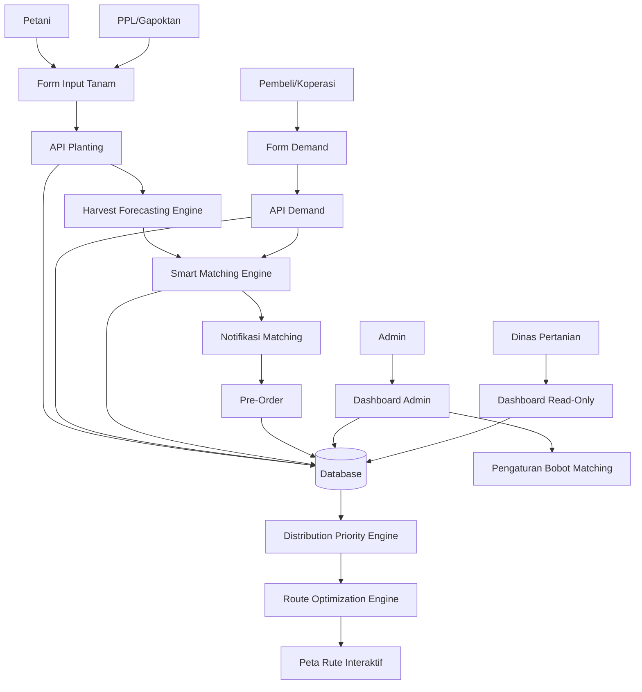
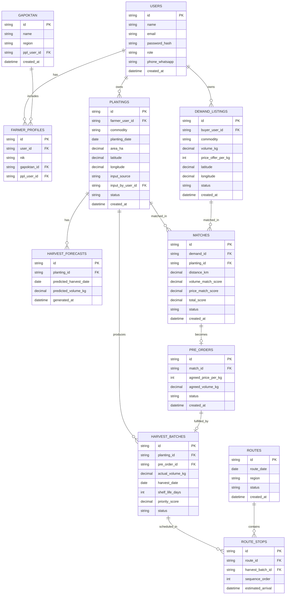

# PRD — Project Requirements Document

## 1. **Overview**
TaniLink adalah platform web yang menghubungkan petani dan pembeli institusional (koperasi, pabrik, supermarket) sejak tahap rencana tanam, bukan hanya setelah panen selesai seperti kebanyakan platform agritech yang sudah ada. Sistem menggabungkan prediksi panen, prediksi harga/permintaan, pencocokan otomatis (matching) antara petani dan pembeli, prioritas distribusi berdasarkan risiko kerusakan, serta optimasi rute pengiriman dalam satu alur yang saling terhubung.

Masalah utama yang diselesaikan:
- Petani menanam dan memanen tanpa kepastian pembeli, sehingga hasil panen sering tidak sesuai kebutuhan pasar.
- Petani sangat bergantung pada tengkulak karena minimnya akses informasi harga pasar.
- Panen yang terjadi serentak di banyak lokasi tidak dikirim dengan urutan yang mempertimbangkan risiko kerusakan.
- Pengambilan hasil panen dari banyak titik lahan yang tersebar dilakukan tanpa perencanaan rute, sehingga waktu tempuh lama dan komoditas rusak di jalan.
- Tidak semua petani terbiasa atau mampu mengoperasikan sistem digital secara mandiri.

Tujuan utama aplikasi:
- Menyediakan sistem prediksi panen dan prediksi harga/permintaan berbasis data historis.
- Memungkinkan pembeli mempublikasikan kebutuhan dan mendapat rekomendasi petani yang cocok secara otomatis.
- Mendukung kesepakatan pre-order antara petani dan pembeli sebelum panen selesai.
- Memberikan urutan prioritas distribusi dan rute pengiriman yang efisien setelah panen tiba.
- Mendukung input data secara berlapis (petani sendiri, keluarga, Gapoktan, atau PPL) supaya petani yang belum terbiasa digital tetap bisa terwakili.
- Menyediakan dashboard khusus untuk Dinas Pertanian sebagai alat bantu kebijakan ketahanan pangan wilayah.

## 2. **Requirements**
- Sistem harus mendukung banyak peran pengguna: Petani, Pembeli/Koperasi, Penyuluh (PPL), Admin, dan Dinas Pertanian (read-only).
- Setiap petani dapat memiliki satu atau lebih data lahan/tanam (planting).
- Data tanam mencakup komoditas, tanggal tanam, luas lahan, dan titik koordinat lokasi.
- Sistem harus menghasilkan prediksi waktu panen dan estimasi volume berdasarkan data tanam yang diagregasi per wilayah.
- Sistem harus menghasilkan prediksi harga 1–4 minggu ke depan berdasarkan data harga historis, permintaan, dan data cuaca.
- Pembeli dapat mempublikasikan kebutuhan (demand) berupa komoditas, volume, harga penawaran, dan lokasi tanpa perlu menunggu hasil panen tersedia.
- Sistem harus mencocokkan demand pembeli dengan planting petani menggunakan skor gabungan dari kedekatan lokasi, kesesuaian volume, dan kesesuaian harga, dengan bobot yang dapat diatur admin.
- Kesepakatan hasil matching dapat ditingkatkan menjadi pre-order sebelum panen selesai.
- Setelah panen tiba, sistem harus menentukan prioritas distribusi berdasarkan umur simpan komoditas dan prediksi cuaca.
- Sistem harus mengelompokkan titik-titik panen secara geografis dan menentukan urutan rute penjemputan yang efisien.
- Data dapat diinput oleh petani sendiri, anggota keluarga menggunakan akun yang sama, pengurus Gapoktan/Poktan secara kolektif, atau PPL atas nama petani binaannya (input by proxy).
- Setiap entri data harus menyimpan metadata sumber input (`input_source`) untuk keperluan audit, tanpa memengaruhi hasil forecasting, matching, atau tampilan ke pihak lain.
- Dinas Pertanian hanya memiliki akses baca (read-only) terhadap data agregat regional, tren harga, dan potensi surplus/defisit wilayah.
- Sistem harus mobile-friendly karena mayoritas petani dan PPL kemungkinan mengakses melalui HP di lapangan.
- MVP tidak membutuhkan pembayaran otomatis (payment gateway); transaksi hasil pre-order disepakati di luar sistem atau dicatat manual oleh admin.
- MVP tidak membutuhkan Quality Grading berbasis computer vision maupun Blockchain Traceability; keduanya menjadi roadmap pengembangan lanjutan.

## 3. **Core Features**

- **Landing Page Utama Platform**
  - Menjelaskan manfaat TaniLink untuk petani, pembeli/koperasi, dan Dinas Pertanian.
  - CTA untuk daftar sebagai Petani, Pembeli, atau PPL.
  - Showcase alur kerja: dari input tanam sampai pengiriman.

- **Harvest Forecasting (Prediksi Panen)**
  - Petani/PPL/Gapoktan menginput data tanam: komoditas, tanggal tanam, luas lahan, titik lokasi.
  - Sistem mengagregasi data per wilayah untuk memperkirakan waktu panen dan estimasi volume.
  - Hasil ditampilkan sebagai peta sebaran komoditas (heatmap) dan ringkasan per wilayah.

- **Price & Demand Prediction (Prediksi Harga & Permintaan)**
  - Sistem mengolah data harga historis, data cuaca (curah hujan & suhu), dan histori permintaan.
  - Menghasilkan grafik prediksi harga 1–4 minggu ke depan dan rekomendasi waktu jual terbaik.

- **Manajemen Demand (Pembeli)**
  - Pembeli/koperasi membuat listing kebutuhan: komoditas, volume, harga penawaran, lokasi.
  - Pembeli dapat melihat peta sebaran prediksi panen di sekitar lokasinya.

- **Smart Matching & Pre-Order**
  - Sistem mencocokkan demand pembeli dengan planting petani menggunakan skor gabungan (Haversine untuk jarak, kesesuaian volume, kesesuaian harga).
  - Bobot skor (w1, w2, w3) dapat diatur oleh Admin.
  - Kedua pihak menerima notifikasi saat skor kecocokan tinggi, dan dapat menyepakati pre-order.

- **Distribution Priority (Prioritas Distribusi)**
  - Setelah panen tercatat sebagai batch siap kirim, sistem menghitung skor prioritas berdasarkan umur simpan komoditas, prediksi cuaca, dan jadwal panen.
  - Daftar prioritas ditampilkan ke Admin/PPL untuk menentukan urutan pengambilan.

- **Route Optimization (Optimasi Rute)**
  - Titik-titik panen yang siap angkut dikelompokkan secara geografis (clustering sederhana).
  - Urutan penjemputan ditentukan dengan heuristik nearest-neighbor.
  - Rute divisualisasikan pada peta interaktif, lengkap dengan estimasi waktu tempuh.

- **Manajemen Input Berlapis (Multi-Source Data Entry)**
  - Petani dapat input mandiri melalui form sederhana.
  - PPL memiliki tampilan batch entry untuk menginput data banyak petani binaannya sekaligus (input by proxy).
  - Gapoktan/Poktan dapat menginput data secara kolektif untuk anggotanya.
  - Setiap entri menyimpan metadata `input_source` dan `input_by_user_id` untuk audit, tanpa memengaruhi output sistem.

- **Dashboard Admin**
  - Ringkasan planting aktif, demand aktif, matching pending, dan batch siap distribusi.
  - Panel pengaturan bobot Smart Matching Engine.
  - Resolusi dispute data (misalnya data planting yang diklaim ganda).

- **Dashboard Dinas Pertanian (Read-Only)**
  - Data agregat regional: tren harga per komoditas, sebaran planting, potensi surplus/defisit wilayah.
  - Tidak dapat mengubah data apa pun, hanya memantau.

## 4. **User Flow**

### Flow Petani (Input Mandiri)
1. Petani mendaftar/login ke sistem.
2. Petani menambahkan data lahan/tanam: komoditas, tanggal tanam, luas lahan, titik lokasi.
3. Sistem menampilkan estimasi waktu panen dan prediksi harga terkait komoditas tersebut.
4. Petani menerima notifikasi ketika ada demand pembeli yang cocok dengan plantingnya.
5. Petani meninjau tawaran dan menyetujui pre-order jika sesuai.
6. Saat panen tiba, petani/PPL menandai batch sebagai siap kirim.
7. Petani melihat urutan prioritas distribusi dan jadwal penjemputan di dashboardnya.

### Flow PPL/Gapoktan (Input by Proxy)
1. PPL login ke dashboard khusus penyuluh.
2. PPL memilih petani binaan dari daftar wilayah kerjanya.
3. PPL menginput atau memperbarui data tanam atas nama petani tersebut (batch entry untuk banyak petani sekaligus).
4. Data yang diinput PPL diproses sistem dengan cara yang sama seperti input mandiri petani.
5. PPL dapat memantau ringkasan planting dan status distribusi wilayah binaannya.

### Flow Pembeli/Koperasi
1. Pembeli mendaftar/login ke sistem.
2. Pembeli membuat listing demand: komoditas, volume, harga penawaran, lokasi.
3. Sistem menampilkan rekomendasi petani yang cocok berdasarkan skor matching.
4. Pembeli meninjau rekomendasi dan mengajukan atau menyetujui pre-order.
5. Pembeli memantau status distribusi batch yang sudah disepakati hingga sampai ke lokasinya.

### Flow Admin
1. Admin login ke dashboard.
2. Admin memantau ringkasan planting, demand, dan matching yang berjalan.
3. Admin mengatur bobot Smart Matching Engine (w1, w2, w3) sesuai kebutuhan.
4. Admin meninjau dan menyelesaikan dispute data jika ada.
5. Admin memantau daftar prioritas distribusi dan status rute pengiriman.

### Flow Dinas Pertanian
1. Dinas Pertanian login dengan akses read-only.
2. Dinas Pertanian memantau data agregat regional: sebaran planting, tren harga, potensi surplus/defisit.
3. Data digunakan sebagai dasar kebijakan ketahanan pangan wilayah, di luar sistem TaniLink.

## 5. **Architecture**
Aplikasi menggunakan arsitektur full-stack web app. Frontend menangani landing page, form input tanam, halaman demand pembeli, dashboard Admin/PPL/Dinas Pertanian, dan visualisasi peta. Backend/API menangani autentikasi, data planting, demand, matching engine, prioritas distribusi, dan optimasi rute. Database menyimpan seluruh data dengan pemisahan akses berdasarkan role (RBAC), sehingga setiap peran hanya dapat mengakses data dan aksi yang menjadi wewenangnya.

Komponen utama:
- **Public/Landing Pages**: halaman utama platform dan onboarding tiap peran.
- **Data Entry Layer**: form input tanam yang dapat diakses oleh petani, PPL, maupun Gapoktan (input by proxy), dengan metadata sumber input.
- **Harvest Forecasting Engine**: mengagregasi data tanam menjadi prediksi waktu dan volume panen per wilayah.
- **Price & Demand Prediction Engine**: mengolah data historis harga, permintaan, dan cuaca menjadi prediksi harga.
- **Smart Matching Engine**: mencocokkan demand pembeli dengan planting petani berdasarkan skor gabungan.
- **Distribution Priority Engine**: menghitung urutan prioritas pengiriman batch panen.
- **Route Optimization Engine**: mengelompokkan titik panen dan menentukan urutan rute penjemputan.
- **Authentication & RBAC**: login khusus untuk Petani, Pembeli, PPL, Admin, dan Dinas Pertanian, dengan pembatasan akses sesuai peran.
- **Admin Dashboard**: pengelolaan bobot matching dan resolusi dispute data.
- **Dinas Pertanian Dashboard**: akses read-only terhadap data agregat regional.

## 6. **Database Schema**
Berikut struktur database high-level untuk MVP.

### `users`
Menyimpan data seluruh pengguna sistem.
- `id` — text/uuid, ID unik user.
- `name` — text, nama pengguna.
- `email` — text, email untuk login.
- `password_hash` — text, hash password.
- `role` — text, salah satu dari: `petani`, `pembeli`, `ppl`, `admin`, `dinas_pertanian`.
- `phone_whatsapp` — text, nomor WhatsApp pengguna.
- `created_at` — datetime, waktu akun dibuat.

### `gapoktan`
Menyimpan data kelompok tani/gabungan kelompok tani.
- `id` — text/uuid, ID unik Gapoktan.
- `name` — text, nama Gapoktan/Poktan.
- `region` — text, wilayah kerja.
- `ppl_user_id` — text/uuid nullable, relasi ke PPL pembina.
- `created_at` — datetime, waktu data dibuat.

### `farmer_profiles`
Menyimpan data tambahan khusus petani.
- `id` — text/uuid, ID unik profil.
- `user_id` — text/uuid, relasi ke `users`.
- `nik` — text nullable, nomor identitas petani.
- `gapoktan_id` — text/uuid nullable, relasi ke `gapoktan`.
- `ppl_user_id` — text/uuid nullable, relasi ke PPL pembina langsung.

### `plantings`
Menyimpan data tanam/lahan yang diinput.
- `id` — text/uuid, ID unik planting.
- `farmer_user_id` — text/uuid, relasi ke petani pemilik data.
- `commodity` — text, jenis komoditas.
- `planting_date` — date, tanggal tanam.
- `area_ha` — decimal, luas lahan dalam hektar.
- `latitude` — decimal, titik koordinat lahan.
- `longitude` — decimal, titik koordinat lahan.
- `input_source` — text, sumber input: `self`, `family`, `gapoktan`, `ppl`.
- `input_by_user_id` — text/uuid, relasi ke user yang benar-benar menginput data.
- `status` — text, status planting: `growing`, `ready_to_harvest`, `harvested`.
- `created_at` — datetime, waktu data dibuat.

### `harvest_forecasts`
Menyimpan hasil prediksi panen per planting.
- `id` — text/uuid, ID unik forecast.
- `planting_id` — text/uuid, relasi ke `plantings`.
- `predicted_harvest_date` — date, prediksi tanggal panen.
- `predicted_volume_kg` — decimal, prediksi volume panen dalam kg.
- `generated_at` — datetime, waktu prediksi dibuat.

### `market_prices`
Menyimpan data harga historis per komoditas dan wilayah.
- `id` — text/uuid, ID unik data harga.
- `commodity` — text, jenis komoditas.
- `region` — text, wilayah data harga.
- `price_date` — date, tanggal data harga.
- `price_per_kg` — integer, harga per kg dalam Rupiah.
- `source` — text, sumber data harga.

### `price_predictions`
Menyimpan hasil prediksi harga.
- `id` — text/uuid, ID unik prediksi.
- `commodity` — text, jenis komoditas.
- `region` — text, wilayah prediksi.
- `predicted_week_start` — date, awal minggu prediksi.
- `predicted_price_per_kg` — integer, prediksi harga per kg.
- `generated_at` — datetime, waktu prediksi dibuat.

### `demand_listings`
Menyimpan kebutuhan yang dipublikasikan pembeli.
- `id` — text/uuid, ID unik demand.
- `buyer_user_id` — text/uuid, relasi ke pembeli.
- `commodity` — text, jenis komoditas dibutuhkan.
- `volume_kg` — decimal, volume yang dibutuhkan.
- `price_offer_per_kg` — integer, harga penawaran per kg.
- `latitude` — decimal, titik lokasi pembeli/gudang.
- `longitude` — decimal, titik lokasi pembeli/gudang.
- `status` — text, status demand: `open`, `matched`, `closed`.
- `created_at` — datetime, waktu demand dibuat.

### `matches`
Menyimpan hasil pencocokan antara demand dan planting.
- `id` — text/uuid, ID unik match.
- `demand_id` — text/uuid, relasi ke `demand_listings`.
- `planting_id` — text/uuid, relasi ke `plantings`.
- `distance_km` — decimal, jarak hasil perhitungan Haversine.
- `volume_match_score` — decimal, skor kesesuaian volume.
- `price_match_score` — decimal, skor kesesuaian harga.
- `total_score` — decimal, skor gabungan akhir.
- `status` — text, status match: `proposed`, `accepted`, `rejected`.
- `created_at` — datetime, waktu match dibuat.

### `pre_orders`
Menyimpan kesepakatan pre-order hasil dari match yang diterima.
- `id` — text/uuid, ID unik pre-order.
- `match_id` — text/uuid, relasi ke `matches`.
- `agreed_price_per_kg` — integer, harga yang disepakati.
- `agreed_volume_kg` — decimal, volume yang disepakati.
- `status` — text, status pre-order: `pending`, `confirmed`, `cancelled`.
- `created_at` — datetime, waktu pre-order dibuat.

### `harvest_batches`
Menyimpan data batch panen yang siap didistribusikan.
- `id` — text/uuid, ID unik batch.
- `planting_id` — text/uuid, relasi ke `plantings`.
- `pre_order_id` — text/uuid nullable, relasi ke `pre_orders` jika sudah terikat kesepakatan.
- `actual_volume_kg` — decimal, volume panen aktual.
- `harvest_date` — date, tanggal panen aktual.
- `shelf_life_days` — integer, estimasi umur simpan komoditas dalam hari.
- `priority_score` — decimal, skor prioritas distribusi.
- `status` — text, status batch: `ready`, `in_transit`, `delivered`.

### `routes`
Menyimpan data rute pengambilan/pengiriman.
- `id` — text/uuid, ID unik rute.
- `route_date` — date, tanggal rute dijalankan.
- `region` — text, wilayah cakupan rute.
- `status` — text, status rute: `planned`, `in_progress`, `completed`.
- `created_at` — datetime, waktu rute dibuat.

### `route_stops`
Menyimpan urutan titik pemberhentian dalam sebuah rute.
- `id` — text/uuid, ID unik stop.
- `route_id` — text/uuid, relasi ke `routes`.
- `harvest_batch_id` — text/uuid, relasi ke `harvest_batches`.
- `sequence_order` — integer, urutan kunjungan dalam rute.
- `estimated_arrival` — datetime, estimasi waktu tiba.

## 7. **Tech Stack**
Rekomendasi tech stack untuk MVP full-stack:

- **Framework**: Next.js
  - Cocok untuk landing page, form input tanam, dashboard multi-role, dan API route dalam satu project.

- **Styling**: Tailwind CSS
  - Mempercepat pembuatan UI yang responsif dan mobile-friendly, penting karena mayoritas petani dan PPL mengakses lewat HP.

- **UI Components**: shadcn/ui
  - Cocok untuk dashboard Admin/PPL, form input data, tabel planting/demand/batch, dan komponen data-heavy lainnya.

- **Peta Interaktif**: Leaflet.js
  - Digunakan untuk menampilkan sebaran planting, lokasi demand, dan visualisasi rute optimasi.

- **Visualisasi Data**: Chart.js
  - Digunakan untuk grafik prediksi harga dan tren permintaan.

- **ORM**: Drizzle ORM
  - Ringan dan cocok untuk schema database relasional yang jelas seperti di atas.

- **Database**: SQLite untuk MVP lokal/demo
  - Sederhana untuk showcase dan cepat dikembangkan.
  - Jika lanjut ke produksi, dapat dinaikkan ke PostgreSQL dengan skema yang sama.

- **Authentication**: Better Auth
  - Digunakan untuk login seluruh peran (Petani, Pembeli, PPL, Admin, Dinas Pertanian) dengan Role-Based Access Control (RBAC) di level endpoint API.

- **Deployment**: Vercel
  - Mudah untuk deploy aplikasi Next.js secara cepat.

- **File Upload Opsional**: UploadThing atau storage kompatibel S3
  - Untuk unggah foto lahan, foto hasil panen, atau dokumentasi lain jika diperlukan.

- **Enhancement Opsional (Roadmap)**:
  - TensorFlow.js untuk Quality Grading otomatis dari foto hasil panen.
  - Struktur hash-chain sederhana (SHA-256) untuk traceability batch komoditas.
  - Integrasi API cuaca (misalnya data BMKG) untuk memperkuat akurasi Price & Demand Prediction dan Distribution Priority.
  - PostgreSQL untuk kebutuhan production-ready dengan volume data lebih besar.
